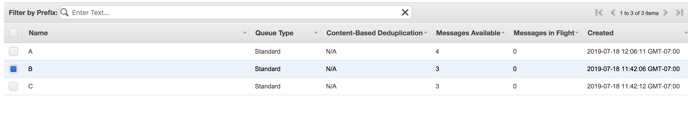
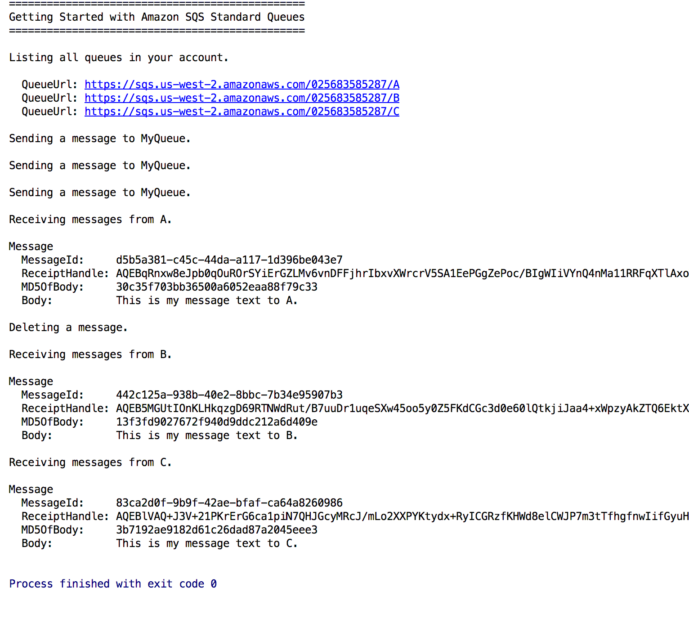

# SQS

Three queues (A, B, C) that receive their own messages.

## How would I test?
See if the size of queue changes after message sent. Loop through and see if the message is there after the time sent.

## Verification (Test)
First queue shows message and deletes message.
Queue B and C rack up messages.

